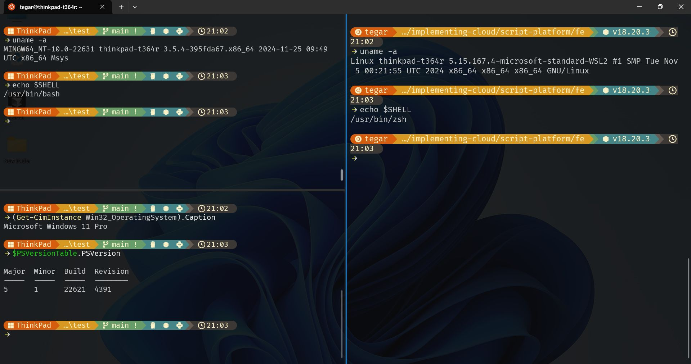

# dotfiles

My Dotfiles for windows, linux and Mac

## Single Terminal Prompt for All Shells



### Windows GitBash

* Install gitbash https://git-scm.com/downloads
* (optional) Setup [windows-terminal.json](windows-terminal.json) for keyboard binding and default appearance
* Using gitbash, Install starship prompt and several apps

```
winget install starship
winget install fzf eza-community.eza sharkdp.bat sharkdp.fd BurntSushi.ripgrep.MSVC Clement.bottom
scoop install dust
```

* Copy [.bashrc](./.bashrc) and optionally [.vimrc](./.vimrc)

* Then use your [prefered theme](https://starship.rs/presets/)

```
mkdir -p ~/.config
starship preset gruvbox-rainbow -o ~/.config/starship.toml
```

### Windows PowerShell

* Using PowerShell, run `notepad $PROFILE`. It will be open notepad and create a new file if not exist
* Copy-paste the content of [PowerShell profile](./Microsoft.PowerShell_profile.ps1) then save
* Open new powershell in it should use the new starship prompt

### Ubuntu

TBA